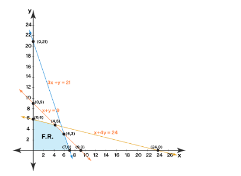

# <b>LP optimization</b>

**Linear programming** is a process that is used to determine the **best outcome of a linear function.**
* It is the best method to perform linear optimization by making a few simple assumptions.
* The **linear function** is known as the **objective function**

 Linear programming, also abbreviated as **LP**, is a simple method that is used to depict complicated real-world relationships by using a linear function.

  The elements in the mathematical model so obtained **have a linear relationship with each other**. Linear programming is used to perform **linear optimization** so as to achieve the best outcome.

## <b>Linear programming </b>

  **<i>Linear programming</i>** can be defined as a technique that is used for optimizing a linear function in order to reach the best outcome. This **linear function** or **<i>objective function</i>** consists of linear equality and inequality constraints. We obtain the best outcome by <u>minimizing</u> or <u>maximizing</u> the objective function.

  <b> <i> A linear programming problem will consist of: </i> </b> 

  * decision variables

   The decision variables, x, and y, decide the output of the LP problem and represent the final solution. 

  * an objective function;

 The objective function, Z, is the linear function that needs to be optimized (maximized or minimized) to get the solution. 

  * constraints;

The constraints are the restrictions that are imposed on the decision variables to limit their value. 

  * non-negative restrictions.

The decision variables must always have a non-negative value which is given by the non-negative restrictions.

## <b>Setting up the problem</b>
  
<b>Objective function</b>: 
$$
  Z = ax + by
$$

<b>Constraints</b>: 
$$
  cx + dy ≤ (or) ≥ e
$$
$$
  fx + gy ≤ (or) ≥ h
$$

<b>Non-negative restrictions</b>: 
$$
  x≥0
$$
$$
  y≥0
$$

  
## <b>Methods of solving</b>

### <b><i>Simplex method</i></b>
  
This method is perfomed in a few steps:

* Step 1 

<b>Convert the inequalities into equations.</b>

* Step 2

<b>Construct the initial simplex tableau.</b>

* Step 3

<b>The most negative entry in the bottom row identifies the pivot column.</b>

* Step 4

<b>Calculate the quotients.</b>

 Here the smallest quotient identifies a row. The element in the intesection of the column identified in step 3 and the row identified in this step is identified as the pivot element

* Step 5

<b>Perform pivoting to make all other entries in this column zero.</b>

* Step 6

<b> When there are no more negative entries in the bottom row, we are finished; otherwise, we start again from step 3. </b>

* Step 7

<b> Calculate the answer from all of the previous steps </b>

## <b> Example of usage </b>

### <b><i>Setting the task</i></b>

<b>Maximixe:</b> 
$$Z = 40x_1 + 30x_2$$

<b>Subject to:</b> 
$$x_1 + x_2 <= 12$$
$$2x_1 + x_2 <= 16$$
**where:**
$$x_1 >= 0$$ 
$$x_2 >= 0$$

* Step 1 

Considering the first equation: 
$$ x_1 + x_2 <= 12 $$
What this step requires is simply adding one slack variable as follows: 
$$ x_1 + x_2 + y_1 = 12 $$

The newly added variable $y_1$ represents the amount by which $x_1 + x_2$ falls short of 12

Next in this step is to rewrite the objective function:

$$Z = 40x_1 + 30x_2$$
 <b>as follows: </b> 
$$- 40x_1 - 30x_2 + Z =0$$

<b>The final result of step 1 would be</b>

* Updated objective function : 
$$- 40x_1 - 30x_2 + Z =0$$

* Updated subject to constraints:
$$ x_1 + x_2 + y_1 = 12 $$

$$ 2x_1 + x_2 + y_2 = 16 $$

$$x_1 >= 0$$ 
$$x_2 >= 0$$

* Step 2

 Each inequality constraint appears in its own row. (The non-negativity constraints do not appear as rows in the simplex tableau.) Write the objective function as the bottom row.

| $x_1$  | $x_2$ |$y_1$  |$y_2$  |$Z$  |$C$  |
| ------------- | ------------- | ------------- | ------------- | ------------- | ------------- |
| 1  | 1  | 1  | 0  | 0  | 12 |
| 2  | 1  | 0  | 1  | 0  | 16 |
| -40  | -30  | 0  | 0  | 1  | 0  |

If $x_1$ and $x_2$ are arbitrary choosen as $x_1=0$, $x_2=0$ the following matrix should be obtained:

| $y_1$         | $y_1$          | $Z$   | $C$   |
| ------------- |:-------------:| -----:| -----:|
| 1     | 0|    0 |12|
| 0      | 1      |   0  | 16|
| 0 | 0      |    1 | 0 |

From this matrix we obtain: $y_1 = 12$, $y_2=16$, $Z=0$

* Step 3

The most negative entry in the bottom row is -40; therefore the column 1 is identified.

We choose the most negative entry in the bottom row, because it represents the largest coefficient in the objective function - the coefficient whose entry will increase the value of the objective function the quickest

* Step 4

When we choose the most negative entry in the bottom row, we are trying to increase the value of the objective function by bringing in the variable  x1 

Following the algorithm, in order to calculate the quotient, we divide the entries in the far right column by the entries in column 1, excluding the entry in the bottom row.

The smallest of the two quotients, 12 and 8, is 8. Therefore row 2 is identified. The intersection of column 1 and row 2 is the entry 2, which has been highlighted. This is our pivot element.

The simplex method begins with a corner point and then moves to the next corner point always improving the value of the objective function. The value of the objective function is improved by changing the number of units of the variables. We may add the number of units of one variable, while throwing away the units of another. Pivoting allows us to do just that.

* Step 5 

The current state of the matrix is: 

| $x_1$  | $x_2$ |$y_1$  |$y_2$  |$Z$  |  |
| ------------- | ------------- | ------------- | ------------- | ------------- | ------------- |
| 1  | 1  | 1  | 0  | 0  | 12 |
| 1  | $1/2$  | 0  | $1/2$  | 0  | 8|
| -40  | -30  | 0  | 0  | 1  | 0  |

After the reduction of this matrix, the obtained matrix  should look like this: 

| $x_1$  | $x_2$ |$y_1$  |$y_2$  |$Z$  |  |
| ------------- | ------------- | ------------- | ------------- | ------------- | ------------- |
| 0  | $1/2$  | 1  |$-1/2$  | 0  | 4 |
| 1  | $1/2$  | 0  | $1/2$  | 0  | 8|
| 0  | -10  | 0  | 20  | 1  | 320  |

We now determine the basic solution associated with this tableau. By arbitrarily choosing $x_2=0$, and $y_2=0$, the following matrix should be obtained:

| $y_1$         | $y_1$          | $Z$   | $C$   |
| ------------- |:-------------:| -----:| -----:|
| 0     | 1|    0 |4|
| 1      | 0      |   0  | 8|
| 0 | 0      |    1 | 320 |

Restating, we get: 

$x_1=8$, and $y_1=4$, and $x_2=0$, and $y_2=0$, and $z=320$

* Step 7 

There still is the negative entry -10, therefore after we proceed with step 4 once more, what we finally obtain is:

| $x_1$  | $x_2$ |$y_1$  |$y_2$  |$Z$  |  |
| ------------- | ------------- | ------------- | ------------- | ------------- | ------------- |
| 0  | 1  | 2  |-1  | 0  | 8 |
| 1  | 0  | -1  | 1  | 0  | 4|
| 0  | 0  | 20  | 10  | 1  | 400  |

We no longer have negative entries in the bottom row, therefore we are finished.

* Step 7

The obtained final answer is: 

| $x_1$         | $x_2$          | $Z$   | $C$   |
| ------------- |:-------------:| -----:| -----:|
| 0     | 1|    0 |8|
| 1      | 0      |   0  | 4|
| 0 | 0      |    1 | 400 |

### <b><i>Graphical method</i></b>

If there are **two decision variables** in a linear programming problem then the graphical method can be used to solve such a problem easily.

### <b><i>Setting the task</i></b>
<b>Maximixe:</b> 
$$Z = 2x + 5y$$

<b>Subject to:</b> 
$$x+4y <= 24$$
$$3x+y <= 21$$
$$x+y <= 9$$
**where:**

$$x >= 0$$ 
$$y >= 0$$

The task is simple: 

* Step 1 

Rewrite the inequalities to iqualities, as follows: 
$$x+4y = 24$$
$$3x+y = 21$$
$$x+y = 9$$
 
and plot each equation on the X0Y graph, as follows: 

The F.R. region is the following region considering all five inequalities in the problem setting.

The final table we get from the graph would be:

| $x_1$    | $x_2$          
| -------- |:-:|
| O=(0,0)  | 0      |
| A=(7,0)  | 14     |
| B=(6,3)  | 27     |
| C=(4,5)  | 33     |
| D=(0,6)  | 30     |

33 is the maximum value of Z and it occurs at C, thus the solution is $x=4$ and $y=5$

##  Gurobi optimization approach 